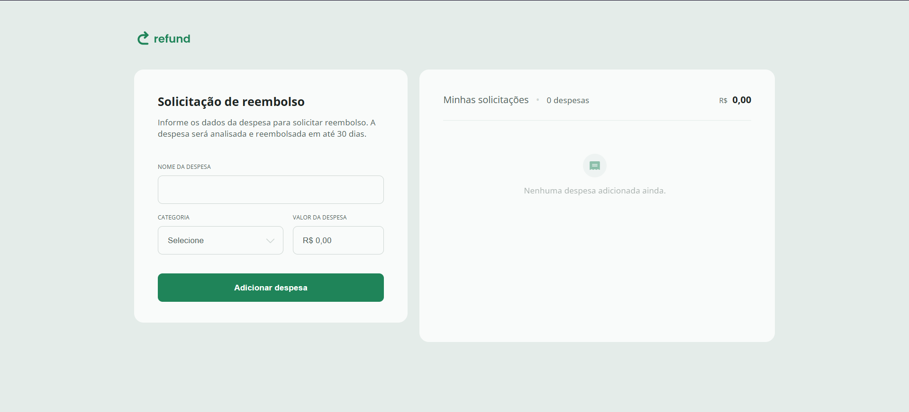

<p align="center">
  
</p>

<p align="center">
  
  
  
</p>

<br>

<p align="center">
  <a href="#-projeto">Projeto</a>&nbsp;&nbsp;&nbsp;|&nbsp;&nbsp;&nbsp;
  <a href="#-tecnologias">Tecnologias</a>&nbsp;&nbsp;&nbsp;|&nbsp;&nbsp;&nbsp;
  <a href="#-funcionalidades">Funcionalidades</a>&nbsp;&nbsp;&nbsp;|&nbsp;&nbsp;&nbsp;
  <a href="#-como-usar">Como usar</a>&nbsp;&nbsp;&nbsp;|&nbsp;&nbsp;&nbsp;
  <a href="#-licença">Licença</a>
</p>

<br>

## 💻 Projeto

O **Refund** é uma aplicação web para registro e controle de solicitações de reembolso de despesas corporativas. O usuário adiciona despesas por categoria, acompanha o total em tempo real e os dados ficam salvos mesmo após fechar o navegador.

🔗 [Acessar projeto online](https://ofelipepierre.github.io/refund)

<br>

## 🚀 Tecnologias

Esse projeto foi desenvolvido com as seguintes tecnologias:

- HTML5
- CSS3
- JavaScript

<br>

## ✨ Funcionalidades

- Cadastro de despesas com nome, categoria e valor
- Categorias: Alimentação, Hospedagem, Serviços, Transporte e Outros
- Formatação automática de valores em Real Brasileiro (BRL)
- Totalização em tempo real das despesas adicionadas
- Remoção de itens com animação de saída
- Validação de campos (nome vazio e valor zero)
- Estado vazio com feedback visual quando não há despesas
- **Persistência com `localStorage`** — dados mantidos ao recarregar a página
- Layout responsivo para mobile, tablet e desktop

<br>

## 🔧 Como usar

```bash
# Clone o repositório
git clone https://github.com/ofelipepierre/refund.git

# Abra o index.html no navegador
# Nenhuma dependência ou instalação necessária
```

Ou acesse direto pelo [GitHub Pages](https://ofelipepierre.github.io/refund).

<br>

## 📁 Estrutura

```
refund/
├── .github/
│   └── preview.jpg
├── img/
│   └── ícones SVG das categorias
├── index.html
├── scripts.js
└── styles.css
```

<br>

## 📝 Licença

Esse projeto está sob a licença MIT.

---

Feito por **Felipe Pierre** — [linkedin.com/in/ofelipepierre](https://linkedin.com/in/ofelipepierre)